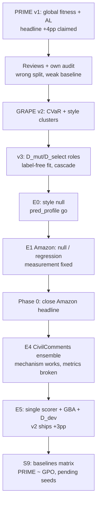

# История проекта GRAPE / PRIME v2: эволюция идеи, экспериментов и статьи

**Назначение документа:** дать читателю без погружения в репозиторий **среднюю по глубине** картину — что это за проект, как менялись гипотезы, какие эксперimentы к чему привели, и где мы сейчас. Документ собран из `README.md`, `SPEC.md`, `APPROACH*.md`, `ROADMAP_*`, `OBSERVATIONS.md`, отчётов E0–E5 и сверки v1↔v2.

**Имена:** в статье метод называется **GRAPE** (Group-Robust Adaptive Prompt Evolution); модуль групп — **SLT** (Soft Latent Types); кодовая база — **PRIME v2**.

---

## Оглавление

1. [Суть проекта в одном абзаце](#1-суть-проекта-в-одном-абзаце)
2. [Откуда мы пришли: PRIME v1 и кризис](#2-откуда-мы-пришли-prime-v1-и-кризис)
3. [Рождение v2: ниша, тезис, первый дизайн](#3-рождение-v2-ниша-тезис-первый-дизайн)
4. [Архитектурная революция: v2 → v3 → SPEC](#4-архитектурная-революция-v2--v3--spec)
5. [Хронология экспериментов](#5-хронология-экспериментов)
6. [Ключевые уроки (сводная таблица)](#6-ключевые-уроки-сводная-таблица)
7. [Как менялся фрейминг статьи](#7-как-менялся-фрейминг-статьи)
8. [Текущее состояние и открытые вопросы](#8-текущее-состояние-и-открытые-вопросы)
9. [Карта документов репозитория](#9-карта-документов-репозитория)

---

## 1. Суть проекта в одном абзаце

Есть **замороженная LLM-система** (API, веса не трогаем): один или несколько моделей + **текстовый промпт** для классификации/аннотации. Данные приходят от **разных источников** (пользователи, домены, identity-группы); на деплое — **новые источники** (distribution shift). Среднее качество приемлемо, но **хвост** (worst-group) проваливается — и именно он определяет пригодность к продакшену.

**GRAPE** пытается стать первой **group-robust дискретной оптимизацией промпта**: вывести **латентные группы** без меток групп, оптимизировать промпт по **CVaR/DRO** над этими группами через **эволюцию** (OpenEvolve), с active learning и интерпретируемыми правилами «если стиль такой — проверь сарказм». Если метод не даёт статзначимого прироста — статья остаётся защищаемой как **первое систематическое исследование** prompt-оптимизаторов под сдвигом (study-фрейминг).

---

## 2. Откуда мы пришли: PRIME v1 и кризис

### 2.1 Что делал v1

| Компонент | Описание |
|-----------|----------|
| **Бэкенд** | Ансамбль gpt-4o-mini + gemini-2.5-flash + claude-3.5-haiku, majority vote |
| **Оптимизация** | OpenEvolve + LLM-мутатор (gemini-2.5-pro) |
| **Active Learning** | Hard/Anchor батчи (~80, ρ=0.7), pool expansion |
| **Задача** | Amazon-WILDS, 5-way sentiment, user shift |
| **З заявленный результат** | R_worst 50.00→55.91, R_global 71.30→75.41 на «полном тесте 34 533» |

### 2.2 Рецензии ACL ARR May'26 (Overall ~2.5)

Конвергентные претензии всех рецензентов:

- **Невалидное сравнение с fine-tuning:** frontier-ансамбль vs DistilBERT; плюс **кастомный сплит**, не официальный WILDS OOD-test.
- **Вырожденный baseline:** стартовый ансамбль (50.0 R_worst) **хуже** одиночного gpt-4o-mini (53.18).
- **Один датасет, нет сидов/CI:** выигрыш над LISA 1.2 пп ≈ заявленный шум 0.5–1.0 пп.
- **Инженерная новизна:** комбинация известных блоков.
- **κ циркулярен:** согласие в fitness → рост κ не независимое свидетельство.
- **Абляции на прокси-метриках**, не на headline.

### 2.3 Собственные находки (глубже рецензий)

```
┌─────────────────────────────────────────────────────────────────┐
│  v1 оптимизировал GLOBAL accuracy, не worst-group              │
│  R_worst в selection с весом 0.15 — метод group-agnostic       │
│  → неудивительно, что EvoPrompt (56.50) ≥ PRIME (55.91) по хвосту│
└─────────────────────────────────────────────────────────────────┘
```

Дополнительно:

- **Сплит 70/15/15** по train-пользователям — сравнение с лидербордом ERM/GroupDRO/LISA **некорректно**.
- **MAP-Elites сбрасывался каждый цикл** — между циклами переходил **один** промпт → обвал на цикле 4 ожидаем.
- Fair-baselines: **EvoPrompt на одном GPT-4o-mini** обгонял ансамблевый PRIME по R_worst.

### 2.4 Декомпозиция «большого» прироста v1 (2026-08, `docs/V1_V2_RECONCILIATION.md`)

| Источник прироста | Величина (ориентир) | Переносимо? |
|-------------------|---------------------|-------------|
| Починка вырожденного ансамбля (κ, tie-break) | ~1.5–2 пп | Нет — v2 стартует с сильного сида |
| Контент промпта (zero-shot → evolved) | **+2.0–2.5 пп** global | **Да** — M21: +2.2 пп на официальном OOD, p=0.015 |
| Преимущество над EvoPrompt | ~1.5 пп / −0.6 worst | В пределах шума (~3 пп между двумя ранами v1) |

**Вывод:** v2 не «сломал» метод — v2 **убрал бесплатный прирост** и измерил **реальный потолок** Amazon prompt-only (~0.72–0.73 R_global).

---

## 3. Рождение v2: ниша, тезис, первый дизайн

### 3.1 Свободная ниша (из README §3)

| Уже сделано | Ещё не сделано |
|-------------|----------------|
| EvoPrompt, GEPA, APO, OPRO — эволюция/градиент промпта | **Дискретная оптимизация промпта под group shift** |
| GroupDRO, JTT, GEORGE — робастность **весов** | **DRO внутри prompt-optimization** |
| PfR — промпт + обучаемая голова | Prompt-only × worst-group × эволюция |

**Формулировка ниши:** не «OOD обделён LLM», а **«оптимизаторы промптов не проектировались и не проверялись под сдвиг»**.

### 3.2 Первый дизайн GRAPE (APPROACH.md, «v2»)

Шесть опор:

1. **Latent groups** — k-means на профилях пользователей (эмбеддинг + rating-статистики).
2. **CVaR-fitness** — среднее по худшей трети кластеров в батче.
3. **Group-weighted acquisition** — квоты ∝ (1 − Acc_cluster).
4. **QD-архив / Pareto** — специалисты по группам, pool carryover (исправление v1).
5. **Style-conditional правила** в промпте для мутатора.
6. **Спектр маршрутизации A/B/C** — неявный vs явный роутинг по группе.

**Ключевое проектное решение:** группа = **стилевой кластер пользователя**, не user_id (переносимость на новых авторов).

**Страховка:** если E1 no-go → study-фрейминг (E9: систематика {APO, OPRO, EvoPrompt, GEPA} × сдвиг).

### 3.3 SLT — Soft Latent Types (APPROACH_SLT.md)

Уточнение модуля групп:

- Блок **T** (transferable): эмбеддинг, длина, пунктуация — доступен на OOD без меток.
- Блок **C** (calibration): mean rating, дисперсия — только для интерпретации на source.
- **Soft membership** π_u(τ) вместо hard id (апгрейд после E1; дефолт hard для пилота).

---

## 4. Архитектурная революция: v2 → v3 → SPEC

### 4.1 Критика v2 и ответ v3 (APPROACH_V3.md)

| Проблема v2 | Решение v3 |
|-------------|------------|
| k-means в full-проекции, assign в label-free → **две геометрии** | Fit **сразу label-free**; rating только для ANOVA-диагностики |
| Один батч ~80 примеров = mutator + fitness + anchor + QD | **Роли данных:** D_mut, D_select, D_anchor, D_audit, U |
| Дефицит **меток** (AL v1) | Дефицит **API-вызовов** (I3) → **каскад** mut→shard→full |
| κ в fitness | **Медиана** голосов; κ только диагностика |
| Магические веса fitness | **cvar_lex:** CVaR_shrunk + ε·global − len |
| Carryover одной точки | **Per-group Pareto-фронт** + champion archive |

### 4.2 Три инварианта (фильтр для каждого механизма)

| ID | Инвариант | Смысл |
|----|-----------|-------|
| **I1** | Тип, не носитель | Правила про *тип* источника, не про конкретного user_id |
| **I2** | Хвост, не среднее | Отбор не усредняет прогресс слабой группы |
| **I3** | Бюджет = вызовы API | Кэш, каскад, D_select фиксирован на ран |

### 4.3 Иерархия оценки (v3)

```
D_mut (каждая мутация, fit_sources, адversarial)
    ↓
D_select shard → full (heldout, fitness, фронт)
    ↓
D_anchor gate (регрессия)
    ↓
Official val (межцикловой арбитр)
    ↓
Official test (одна сертификация)
```

### 4.4 SPEC.md — нормативный свод

`SPEC.md` консолидирует README + APPROACH + SLT + V3; при конфликте **приоритет у V3**. Содержит contributions C1–C4, план E0–E10, лог решений Р1–Р15, фазы реализации 0–4 (`IMPLEMENTATION.md`).

---

## 5. Хронология экспериментов

### Фаза 0: инфраструктура и E0 — «живы ли группы?»

**Цель E0:** до дорогой эволюции проверить, коррелируют ли **CVaR по кластерам** с официальным **R_worst** на val.

| Этап | Результат | Решение |
|------|-----------|---------|
| E0 small-cap (80 users) | LOO Spearman «go» — **ложный** (M1, M2) | Не гейтить по LOO |
| E0 large-cap, style `full_T` | Kruskal–Wallis **null** (p≈0.78) | Style-кластеры **не работают** на Amazon |
| Пересчёт с **`pred_profile`** | KW **p≈0**, H≈27.6, K=6 | **Go** на pred_profile (C6) |

**`pred_profile`:** k-means на **смеси предсказанных рейтингов** пользователя (mean, std, entropy по классам) — по сути прокси **label mix**, не «стиль письма» (C4, **C10**: 83% spread объясняется class mix).

**Протокольное решение P1–P4:** primary gate = **permutation Kruskal–Wallis**; E1 default geometry = **pred_profile, K=6**.

---

### Фаза 1: E1 — go/no-go «CVaR vs global»

**Дизайн:** одна разница — `fitness: cvar_lex` vs `global`; 1 сид, capped, официальный WILDS, роли данных v3 (D_select для fitness).

#### Волна 1: первые live-раны (июль 2026)

| Run | Итог |
|-----|------|
| `seed42_20260728_091955` | **Abort:** anchor gate «hair trigger» (M7) — 2/50 = весь δ |
| `seed42_20260728_125748` | Завершён; consolidation **съела** gain (O9); R_worst_val **застрял на 0.5** (M9) |
| `seed42_20260729_091203` | Pareto v1: **5 OE iter** — evolution starved (O17) |
| Пара Pareto v2 (0729/0730) | **Статистически null** (M10); cvar поднял D_select-worst cluster, **сломал test-worst** (C8) |

**Механические открытия этой волны:**

- Fitness **шумнее**, чем весь observed gain (M15): SD≈0.029 при движении +0.058 за 3 цикла.
- **120 users недостаточно** для MDE ~0.05 (M13).
- Mutator получает **95% adjacent 4↔5 ошибок** — неразличимых текстово (C9).
- Consolidation, few-shot fiction, cluster-id rules — операционные баги (O9–O13, O22).

#### Волна 2: lowvar + Phase 0 offline

| Run | Итог |
|-----|------|
| `cvar_lowvar/seed42_20260730_114314` | **Первый stat-sig результат — регрессия:** R_global −0.053, p<0.001 (M17). D_select +0.128, test −0.053 = **чистое переобучение на D_select** |
| Phase 0 offline (30 candidates) | Best R_global = **initial**; portfolio LOO **−3.6 pp**; demotion Pareto **пуст** (M18) |

**Решение после Phase 0:**

```
Amazon user-shift → НЕ headline
CVaR/DRO как fitness → REJECT
Robustness → constraint (anchor gate) + global fitness
Headline → CivilComments / category-shift
```

| Run | Итог |
|-----|------|
| `E1_constraint_global` | **PASS mechanics:** +0.004 R_global n.s., без регрессии (M19) |
| `E1_v1_weighted_mini` | v1 fitness не «просыпается» на v3 substrate (M20) |
| `E1_v1_prompt_transfer` | Контент v1 переносится (+2.2 pp), потолок ~0.73 (M21) |
| `E2_cheap_ensemble_global_tail` | Tail-mix **значимо** ухудшает test (M22) |
| `E2_category_shift_books` | Слабый **+** на category shift (M23) |

---

### Фаза 2: CivilComments E4 — проверка «условий применимости»

**Гипотеза (ROADMAP_PHASE2 §1):** group-robust prompt evolution работает, если группа **(1) распознаваема**, **(2) выразима правилом**, **(3) не конфликтует** с majority. Amazon нарушает все три; CivilComments (oracle identity) — a priori да.

| Фаза | Результат |
|------|-----------|
| **2a infra** | Loader, oracle groups, M17 rotate, O22 verbatim few-shot, mutator lint |
| **2b diagnostics** | Gap **35 pp** (male 0.90 vs black 0.55); noise SD 0.0056; **GO** (M26) |
| **2c live E4** | Arm A (`global`) регресс worst-group; Arm B (`min_group_lex`) **C1 работает** (+7 pp worst на D_select за 10 iter) |

**Критические поломки E4:**

| ID | Проблема | Следствие |
|----|----------|-----------|
| **M27** | Stale `combined_score` в OE seed checkpoint | C2–C4 **структурно заблокированы** |
| **M28** | D_select rotate → 12 pp шум vs 3 pp между кандидатами | rotate **off**, D_select=720 |
| **M29** | Inter-day API drift ≈ effect size | Same-day paired protocol |
| **M30** | Fixed D_select → overfit test (−20 flips) | → dev-gate (Phase 3) |
| **M31** | Dead qwen worker; majority=AND; метрики **мертвы** | → Phase 3 / E5 полный редизайн |

---

### Фаза 3: E5 — «один честный scorer, живая метрика»

**ROADMAP_PHASE3:** радикальное упрощение измерения.

| Было (E4) | Стало (E5) |
|-----------|------------|
| 3 воркера, majority | **1 scorer:** gemma-3-12b-it |
| R_worst_group (лотерея n=2–8) | **worst-GBA** = min_g ½(TPR_g+TNR_g) |
| Silent fail → vote 0 | **fail-closed**, INVALID=-1 |
| Full WILDS val Top-1 | **D_dev softmin** + F8 dev-gate |
| test n=800 | **test_fixed n=1800** (8×2×100 + none) |

#### E5v1 → v2 → v3

| Версия | Поиск | Отбор | Test worst-GBA vs seed |
|--------|-------|-------|------------------------|
| **v1** | C2 OE ↑ D_select | Full val **veto** → shipped **seed** | C2 heir **+4 pp** (не shipped) — M32 |
| **v2** | C1 OE 0.723 | **D_dev gate OK** → shipped non-seed | **+3.0 pp** (0.615→0.645) — M33 |
| **v3** | OE 0.710 D_select | D_dev **не промоутит** → seed again — M40 | 0.620 |

**Главный урок E5v2:** эволюция **умела** уже в v1; **сломан был протокол отбора**. Ranked attribution:

1. **selection_split: d_dev** (decisive)
2. GBA + soft_min_lex
3. Single scorer + fail-closed
4. F8 dev-gate
5. Fixed D_select (no rotate)

**Не двигало:** F6 self-consistency (unanimous votes), ensemble, full val selector.

#### S9 — матрица бейзлайнов (Regime-Shift, 3 seeds)

Статус на **2026-08-11** (частично complete):

| method | mean worst-GBA (available seeds) | vs seed Δ |
|--------|----------------------------------|-----------|
| evoprompt_de | 0.658 | +0.015 |
| gpo | 0.656 | +0.013 |
| **PRIME E5v2** (seed42 only) | 0.657 | +0.013 |
| random_al | 0.647 | +0.004 |
| ape | 0.627 | −0.017 |
| apo | 0.621 | −0.022 |

**Provisional:** PRIME **> Random-AL** на seed42, но **< GPO** (−1.5 pp); prereg success (+0.05, beat {APO,GPO,Random-AL}) **не достигнут**. PRIME seeds 43/44 **in flight**.

GPO gate на Yelp→Flipkart: **pass** (реимплементация OK).

---

## 6. Ключевые уроки (сводная таблица)

### 6.1 Метрики и статистика

| Урок | Суть | Практическое правило |
|------|------|----------------------|
| M2 | LOO Spearman смещён отрицательно под null | Gate = **permutation KW**, не Spearman |
| M10 | Пара **underpowered** на 120 users | Bootstrap + MDE перед кампанией |
| M15 | Шум fitness ≈ весь gain | Не интерпретировать stalls как «плохой search» |
| M17 | D_select overfitting **измерим** | Rotate D_select / dev-gate / anchor re-arm |
| M31 | Мёртвая метрика → мёртвые выводы | Pre-flight: ALL-ZERO floor, worker health |
| M29 | API drift ≈ effect | Same-day paired finals |

### 6.2 Группы и объектив

| Урок | Суть |
|------|------|
| C6/C10 | На Amazon `pred_profile` ≈ **label-mix strata**; «style robustness» не claimable |
| C8 | **Argmin tail не переносится** D_select→test |
| C11 | Evolution **двигает порог 4↔5**, платит на 5★ — scalar fitness скрывает trade-off |
| C12 | **+9 pp** доступно только сменой aggregation, не промптом |
| M18 | CVaR-fitness на Amazon → **demotion trap** |

### 6.3 Инженерия и протокол

| Урок | Суть |
|------|------|
| O17/O20 | Мало мутаций → ложный «stall»; много мутаций без fix selection → overfit |
| O26/M27 | Seed checkpoint **must** resync metrics on D_select rotate |
| O28/O30 | OE child **не в** parent budget tracker |
| M32–M33 | **Selector choice** > algorithm choice для «shipped prompt» |

---

## 7. Как менялся фрейминг статьи

### 7.1 Эволюция contributions

| Этап | Ядро статьи | Amazon | CivilComments |
|------|-------------|--------|---------------|
| v1 | Prompt-only бьёт SOTA FT | Headline (+4 pp) | — |
| v2 draft | **GRAPE:** CVaR + latent groups + эволюция | Основной стенд | E4 planned |
| После E0/E1 | + честный **negative** на user-shift | Label-mix groups | — |
| После Phase 0 | Amazon = **mechanics/negative case** | Закрыт | **Headline candidate** |
| Phase 2 | **«Условия применимости»** | Объяснённый negative | Проверка 3 условий |
| Phase 3 E5 | **Protocol + fair baselines** + group objective на **живой** метрике | Sanity re-run | S9 matrix |
| Fallback | **Study C4:** optimizers improve mean, not tail | E9 material | E9 |

### 7.2 Текущая рабочая формулирука (для неискушённого читателя)

> Мы спрашиваем: **можно ли улучшить worst-group качество LLM-классификатора, меняя только промпт**, когда группы на тесте неизвестны заранее? Мы построили пайплайн (GRAPE): найти группы без меток → оптимизировать промпт на хвост → активно отбирать ошибки → эволюционировать правила. На **Amazon user-shift** оказалось, что «группы» сводятся к смеси классов, а prompt-only потолок ~2–3 pp — **отрицательный/ограничивающий результат**. На **CivilComments** метрика и протокол пришлось **перестроить с нуля** (один scorer, GBA, dev-gate); эволюция **находит** лучшие промпты, но **отбор** и **сравнение с GPO/EvoPrompt** ещё не закрыты по 3 seeds.

### 7.3 Что опираемся на литературу

| Линия | Роль в проекте |
|-------|----------------|
| GroupDRO / CVaR-DRO | Объектив хвоста (без градиентов — эволюция) |
| GEORGE / EIIL / JTT | Inferred groups → перенос в prompt-space |
| EvoPrompt / GEPA / APO | Baselines и механика эволюции |
| PfR | Ближайший prompt+group neighbor (CivilComments) |
| GPO (Li et al.) | Главный конкурент на unlabeled target |
| WILDS (Koh et al.) | Протокол OOD, official splits |

---

## 8. Текущее состояние и открытые вопросы

### 8.1 Где мы (август 2026)

| Компонент | Статус |
|-----------|--------|
| Архитектура v3 + E5 fixes (F1–F12) | **Largely implemented** |
| Amazon user-shift | **Closed** (negative/mechanics) |
| E4 CivilComments ensemble-era | **Superseded** by E5 |
| E5v2 shipped prompt | **+3 pp** worst-GBA seed42; selection protocol validated |
| S9 baselines 3-seed | **~90%**; PRIME 43/44 pending |
| OPRO / MIPROv2 | Planned (`NEXT_STEPS.md`) |
| Amazon E5 sanity | Planned (§7.2 ROADMAP_PHASE3) |

### 8.2 Открытые вопросы

1. **PRIME vs GPO/EvoDE** после 3 seeds + stable×3 repeats — метод или протокол?
2. **E5v3 selection debt** (`E5V3_SELECTION_DEBT.md`, M41): починить `_pick_heir` ranking.
3. **Ablation A3:** dev-gate off — causal role of selection.
4. **Aggregation (C12):** отложено; ~9 pp headroom на Amazon.
5. **Soft SLT / inferred groups on CivilComments** (E4 arm C) — не запущено.
6. **Paper claim:** method-framing vs study-framing — зависит от S9 финала.

### 8.3 Диаграмма эволюции мысли (упрощённо)



---

## 9. Карта документов репозитория

| Документ | Роль |
|----------|------|
| `README.md` | История v1, ландшафт, первый план экспериментов |
| `SPEC.md` | **Нормативная** спецификация статьи и кода |
| `APPROACH.md` | Самодостаточное описание GRAPE (v2-эра) |
| `APPROACH_V3.md` | Критическая ревизия архитектуры |
| `APPROACH_SLT.md` | Дизайн Soft Latent Types |
| `IMPLEMENTATION.md` | Фазы 0–4, DoD, тесты |
| `STRATEGY_UNIVERSAL_OOD.md` | Стратегия multi-benchmark |
| `ROADMAP_PHASE2.md` | Решения после Amazon; E4 |
| `ROADMAP_PHASE3.md` | E5 redesign (F1–F12, S9) |
| `experiments/OBSERVATIONS.md` | **Живой журнал** уроков M*, C*, O*, P* |
| `docs/V1_V2_RECONCILIATION.md` | Декомпозиция прироста v1 |
| `experiments/E5_civilcomments/RESULTS.md` | S9 таблицы |
| `experiments/E5_civilcomments/E5V2_WHAT_MOVED_EVOLUTION.md` | Attribution v2 |
| `configs/REJECTED_MODELS.md` | qwen3.7-flash и др. |

---

## Приложение A: хронологическая лента экспериментов

| Дата (ориент.) | ID | One-line outcome |
|----------------|-----|------------------|
| 2026-07-27 | E0 small/large | Style null; pred_profile go |
| 2026-07-28 | E1 first live | Anchor bug; consolidation leak |
| 2026-07-29–30 | E1 Pareto pair | Stat null; tail identity mismatch |
| 2026-07-30 | E1 lowvar | **Sig regression**; D_select overfit proven |
| 2026-07-30 | Phase 0 offline | Close Amazon CVaR headline |
| 2026-08-01 | E1 constraint_global | Mechanics pass |
| 2026-08-02 | E2 tail / category | Tail mix bad; category weak + |
| 2026-08-05 | E4 phase 2b | GO CivilComments |
| 2026-08-05–06 | E4 arms A/B | B C1 works; stale score M27 |
| 2026-08-08 | E5 v1 | Search yes, ship seed |
| 2026-08-09 | E5 v2 | **First shipped +3pp GBA** |
| 2026-08-10+ | E5 v3 / S9 | v3 reverts to seed; S9 baselines run |

---

## Приложение B: пример «как ломался и чинился протокол» (anchor gate)

**Проблема (M7):** при |D_anchor|=50 одно изменение = 2% = весь δ → gate отверг кандидата с CVaR +0.044 на D_select.

**Исправление (P6, Р15):** δ как **допуск** (floor 2 examples) + **McNemar** α=0.05; |D_anchor|=100.

**Новая проблема (M12):** при 4–6 регрессиях p=0.0625 > 0.05 — gate **не может** reject.

**Lowvar (M17):** при 15/100 anchor breaks p≈0 — gate **может**; regression поймана in-run, но val selector не остановил ship.

**E5 (F8):** dev-gate на D_dev — другой слой защиты от D_select overfit.

---

*Документ создан для онбординга и подготовки статьи. При новых прогонах обновляйте §5, §8 и `experiments/OBSERVATIONS.md`.*
